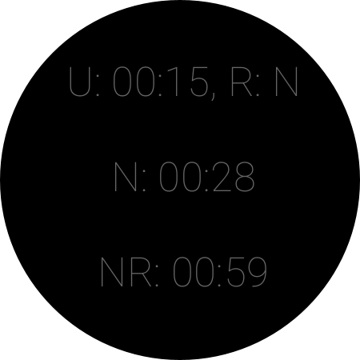

# RunPee Wear

A WearOS companion for the [RunPee](https://runpee.com/) app that tells you when is the most boring part of the movie, where you can go pee
in the movie theater and miss a minimum amount of plot. Since watch is on your wrist all the time, companion allows you to get all
information about pee times without taking out your phone.

To avoid messing around with logging in into RunPee and with subscription, app currently **requires root**
to extract pee times directly from the RunPee app.

## Features

Note: this app makes heavy use of ambient (always-on) display. You need to have it enabled for app to function properly.

Like the RunPee phone app, wear app is also a movie timer. After selecting the movie (see "Usage" below), wear app will give you a cue to
start the timer:

After timer is started, you can turn off the screen of the watch, which will put the app into ambient mode with information about the future
peetimes:

Ambient mode text is intentionally very terse and dim to ensure your watch does not lit up too much in the theater.

Above screen displays:

* Time to the upcoming peetime and whether it is recommended or not
* Time to the next peetime (after the upcoming one on the top)
* Time to the next recommended peetime (after the upcoming one on the top)

When peetime is close, watch will vibrate and ambient screen will display the cue:

You can turn on the watch and scroll down to see the synopsis:

## Usage

Because app gets data from the RunPee app, its usage is a bit more involved. But let's be frank, what else are you going to do during
pre-roll ads in your movie theater?

1. Open RunPee app
2. Find the movie you are going to watch
3. Select "View Peetimes" to ensure peetimes are donwloaded
4. Open RunPeeWear on the phone
5. Select the movie you are going to watch
6. Open RunPeeWear on the watch
